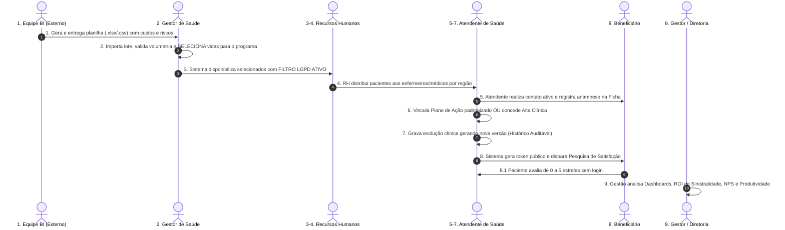

# Documento de Requisitos de Produto (PRD)

## Meu Concierge de Saúde — Sistema de Acompanhamento de Saúde

> **Status do Documento:** Em Revisão / Editável  
> **Versão do Produto:** v0.0.3  
> **Data da Última Atualização:** Março de 2025  
> **Autor / Time Responsável:** Squad de Engenharia e Saúde Corporativa  
> **Público-Alvo:** Gestores de Saúde, Médicos Auditores, RH Corporativo, Atendentes Clínicos e Equipe de Engenharia / Produto

---

## 1. Visão Geral

### 1.1 Descrição do Produto

O **Meu Concierge de Saúde** (marca de aplicação: _CareTrack Saúde_) é uma plataforma corporativa integrada de gestão, triagem e acompanhamento proativo da saúde de colaboradores e dependentes vinculados a planos de saúde empresariais.

O sistema orquestra todo o fluxo de cuidado: desde a identificação de vidas em risco pela equipe de Inteligência de Negócios (BI) e a seleção estratégica pela Gestão Médica, passando pela distribuição operacional pelo RH, atendimento clínico estruturado por profissionais de saúde (médicos e enfermeiros), até a finalização com alta, pesquisa de satisfação automatizada e consolidação analítica de indicadores executivos.

### 1.2 Problema que Resolve

- **Sinistralidade Elevada e Reativa:** Empresas sofrem com reajustes anuais agressivos de planos de saúde por falta de ações preventivas e acompanhamento contínuo de casos crônicos ou de alto custo.
- **Vulnerabilidade Regulatória e LGPD:** O compartilhamento inadvertido de prontuários, laudos e condições clínicas com setores administrativos (como RH) gera graves riscos de não conformidade com a LGPD (Lei Geral de Proteção de Dados - Lei nº 13.709/2018).
- **Descontinuidade do Cuidado:** Falta de protocolos padronizados de acompanhamento entre diferentes operadores de saúde e ausência de histórico versionado das intervenções.
- **Falta de Métricas de Resolutividade e NPS:** Inexistência de mecanismos ágeis para medir a satisfação do paciente após o fechamento do atendimento clínico e o retorno financeiro (ROI) dos programas de saúde.

### 1.3 Objetivo Principal

Prover um ecossistema digital seguro, auditável e em conformidade estrita com a LGPD que permita monitorar ativamente a população segurada, reduzir sinistralidade médica evitável, elevar a satisfação dos beneficiários e otimizar a carga de trabalho das equipes multiprofissionais de saúde.

### 1.4 Proposta de Valor

- **Para a Diretoria / Gestão Médica:** Visibilidade 360° de custos, sinistralidade preditiva, desfechos clínicos e eficácia das linhas de cuidado com controle de acesso irrestrito.
- **Para o RH Corporativo:** Operação simplificada de distribuição e acompanhamento demográfico/geográfico sem risco de exposição a dados sensíveis de saúde e sem responsabilidade civil sobre diagnósticos.
- **Para os Profissionais de Saúde (Atendentes):** Ficha clínica estruturada com planos de cuidado padronizados, versionamento automático com histórico de auditoria e integração com canais ágeis (WhatsApp/Telefone).
- **Para o Beneficiário (Colaborador / Dependente):** Experiência de cuidado personalizado ("concierge"), acolhimento preventivo e canal direto e simplificado de avaliação sem necessidade de login.

---

## 2. Contexto e Oportunidade

### 2.1 Cenário de Segurados com Plano de Saúde

No mercado corporativo atual, cerca de **80% a 85% dos custos assistenciais** concentram-se em uma fatia de **10% a 15% da população segurada** (portadores de doenças crônicas não transmissíveis, pacientes oncológicos, gestantes de alto risco e portadores de dores crônicas com alta frequência de pronto-socorro).

Sem uma atuação coordenada e proativa, esses pacientes navegam pelo sistema de saúde de forma fragmentada, gerando duplicidade de exames, internações hospitalares evitáveis e perda de adesão terapêutica.

### 2.2 O Ciclo de Cuidado Completo

O sistema estabelece uma linha contínua de assistência fundamentada em 5 pilares:

```
[Identificação & Mineração de Dados (BI)]
                    ↓
[Triagem Clínica & Alocação Orçamentária (Gestão Médica)]
                    ↓
[Distribuição Logística & Geográfica (RH — LGPD Protegido)]
                    ↓
[Intervenção Clínica Estruturada & Plano de Cuidado (Atendentes)]
                    ↓
[Desfecho Clínico (Alta), Avaliação (Pesquisa NPS) & Analytics Gerencial]
```

---

## 3. Personas e Agentes

| Agente / Persona                                              | Perfil RBAC            | Acesso ao Sistema?             | Papel Principal                               | Principais Necessidades & Responsabilidades                                                                                                                                                                                                                |
| :------------------------------------------------------------ | :--------------------- | :----------------------------- | :-------------------------------------------- | :--------------------------------------------------------------------------------------------------------------------------------------------------------------------------------------------------------------------------------------------------------- |
| **Equipe de BI (Business Intelligence)**                      | _Nenhum_               | **NÃO ACESSA DIRETAMENTE**     | Mineração de sinistro e extração externa      | Consolida bases de sinistralidade de operadoras e corretoras externas, gerando a planilha de elegíveis (`.xlsx`/`.csv`) com custos acumulados em 12 meses, classificação prévia de risco e diagnósticos principais. Não possui login na plataforma.        |
| **Gestor da Empresa (Médico do Trabalho / Diretor de Saúde)** | `GESTOR`               | **SIM (Acesso Total)**         | Governança clínica, estratégica e financeira  | Importa lotes de planilhas, audita custos assistenciais, seleciona vidas prioritárias, cadastra planos de ação e linhas de cuidado, visualiza prontuários sem restrição LGPD e acompanha ROI/NPS executivo.                                                |
| **Recursos Humanos (RH Corporativo / Business Partner)**      | `RH`                   | **SIM (Filtro LGPD Rigoroso)** | Gestão populacional e distribuição de escalas | Visualiza apenas dados demográficos/cadastrais (nome, matrícula, unidade, telefone). Não tem acesso a condições de saúde, risco ou custos. Distribui os selecionados para as equipes de enfermagem/médicos conforme unidade e carga horária.               |
| **Atendente de Saúde (Enfermeiro(a) / Médico(a) de Família)** | `ATENDENTE`            | **SIM (Filtro LGPD Parcial)**  | Execução do cuidado clínico direto            | Acessa fila de pacientes distribuídos, realiza contato ativo (WhatsApp/Telefone), preenche evolução clínica, vincula metas/planos de ação padronizados, concede alta clínica e aciona disparo de pesquisa de satisfação. Não visualiza custos financeiros. |
| **Beneficiário (Colaborador Titular ou Dependente)**          | _Sem Perfil / Público_ | **SOMENTE VIA LINK PÚBLICO**   | Avaliação do atendimento e satisfação         | Recebe link público temporário com token seguro via WhatsApp ou E-mail após a alta clínica. Responde à pesquisa de 0 a 5 estrelas sem necessidade de criar conta ou realizar login.                                                                        |

---

## 4. Escopo do Produto

### 4.1 Dentro do Escopo (In Scope) — Versão Atual (v0.0.3)

- [x] **Autenticação Segura (RBAC):** Login com JWT via PocketBase, separação estrita de 3 perfis no sistema (`GESTOR`, `RH`, `ATENDENTE`) e proteção de rotas via `ProtectedRoute`.
- [x] **Módulo Gestor Completo:**
  - Importação de arquivos `.xlsx` e `.csv` com pré-visualização e geração de Lote (`LOTE_SELECAO`).
  - Painel de Seleção populacional com filtros multidimensionais (risco, unidade, custo, status).
  - CRUD de Beneficiários com visualização de dados clínicos e financeiros.
  - CRUD de Usuários e Operadores (médicos e enfermeiros com número de registro CRM/COREN).
  - Catálogo de Planos de Ação padronizados (necessidade, objetivo, conduta, prazo em dias e prioridade).
  - Gestão de Controle de Programas de Saúde Crônica (linhas de cuidado).
  - Dashboard Executivo com gráficos (distribuição de risco, funil operacional, concentração regional e totalizador de custos assistenciais).
  - Dashboard Comparativo de Produtividade dos Atendentes e NPS médio.
  - Relatórios Executivos com exportação de dados em CSV.
- [x] **Módulo RH em Conformidade LGPD:**
  - Painel de distribuição com mascaramento automático de campos clínicos e financeiros.
  - Distribuição em lote por unidade/região para atendentes ativos com cálculo de balanceamento de carga.
  - Dashboard de acompanhamento da volumetria e status das vidas sem exposição de patologias.
- [x] **Módulo Atendente Clínico:**
  - Fila de atendimento com busca por matrícula/nome e filtros de prioridade.
  - Ficha de Atendimento clínico completa com registro do meio de contato (WhatsApp, Telefone, E-mail, SMS) e status do contato.
  - Preenchimento assistido: vínculo a planos de ação com autopreenchimento de metas, condutas e prazos.
  - Versionamento obrigatório da Ficha (`versao` incremental) com histórico detalhado de auditoria (`historico_fichas`).
  - Fluxo de concessão de Alta Clínica com geração instantânea de token e link público de pesquisa.
  - Dashboard individual de produtividade e resolutividade clínica.
- [x] **Módulo Público de Pesquisa de Satisfação:**
  - Tela pública responsiva acessível via `/pesquisa/:token`.
  - Avaliação de 0 a 5 estrelas interativa com feedback textual opcional.
  - Sincronização automática da nota no prontuário (`fichas_atendimento.feedback`) e encerramento do token.
- [x] **Segurança e Privacidade:**
  - Dupla camada de filtro LGPD: _Collection Rules_ no backend e função `applyLgpdFilter` no frontend.
  - Soft delete em entidades principais (`ativo = false`).

### 4.2 Fora do Escopo (Out of Scope) — Planejado para Versões Futuras

- [ ] Envio real de mensagens via WhatsApp API Oficial (Twilio / Z-API / Gupshup) — _atualmente o link é gerado em tela para cópia ou envio simulado_.
- [ ] Envio real de e-mails transacionais via provedor SMTP / API (SendGrid / Resend / Amazon SES).
- [ ] Conexão de repositório remoto Git externo direto na interface.
- [ ] Automatização de background jobs / cron nativos no PocketBase para atualização agendada de `dashboard_cache`.
- [ ] Prontuário Eletrônico com assinatura digital padrão ICP-Brasil / certificado digital CRM médico.
- [ ] Integração nativa bidirecional via HL7 / FHIR com sistemas legados de operadoras (Tasy, MV, Benner).

---

## 5. Fluxo Operacional Detalhado (9 Etapas)



### Detalhamento das Etapas:

1. **Etapa 1 — Geração da Planilha pelo BI:** Extração de sinistralidade e internações dos últimos 12 meses. O BI formata o arquivo com campos obrigatórios e entrega ao Gestor. _(O BI não acessa o sistema)_.
2. **Etapa 2 — Importação e Validação pelo Gestor:** O Gestor realiza upload em `/gestor/importar`, valida os dados na tabela de pré-visualização e processa o lote. Em `/gestor/selecionar`, aplica critérios de corte clínico/financeiro e marca os beneficiários, alterando seu status de `ELEGIVEL` para `SELECIONADO`.
3. **Etapa 3 — Recepção pelo RH com Conformidade LGPD:** O RH acessa o sistema e enxerga imediatamente as vidas selecionadas. A plataforma aplica a máscara de privacidade LGPD, ocultando diagnósticos, classificação de risco e custos financeiros.
4. **Etapa 4 — Distribuição aos Atendentes:** O RH avalia a distribuição geográfica (São Paulo, Rio de Janeiro, Curitiba, etc.) e a carga dos atendentes ativos, selecionando os beneficiários e atribuindo-os a um enfermeiro ou médico. O status evolui para `EM_ATENDIMENTO`.
5. **Etapa 5 — Atendimento Clínico e Contato:** O profissional de saúde alocado acessa `/atendente/fichas`, abre a ficha do paciente e registra a tentativa ou sucesso de contato (meio utilizado, data e desfecho).
6. **Etapa 6 — Plano de Ação ou Alta Clínica:** O atendente seleciona uma linha de cuidado do catálogo de planos de ação (definindo metas e prazos) ou, caso o quadro esteja estabilizado, encaminha para Alta Clínica.
7. **Etapa 7 — Registro de Indicadores e Evolução:** Todos os apontamentos, pendências e observações são gravados. O sistema incrementa a versão da ficha (`versao = versao + 1`) e armazena o snapshot em `historico_fichas` com carimbo de data, hora e responsável.
8. **Etapa 8 — Pesquisa de Satisfação & Feedback:** Ao registrar o desfecho de `ALTA`, o status do beneficiário muda para `ATENDIDO`. O sistema gera um token único associado à ficha e cria o registro em `pesquisas_satisfacao`. O link `https://[dominio]/pesquisa/[token]` é disponibilizado. O beneficiário clica, atribui nota de 0 a 5 estrelas e envia comentário. O feedback sincroniza automaticamente na ficha clínica.
9. **Etapa 9 — Analytics, Relatórios & Dashboards:** O Gestor acompanha em tempo real o Painel Executivo, a produtividade comparativa da equipe, o NPS médio acumulado, a economia estimada sobre sinistros evitados e exporta relatórios em formato CSV.

---

## 6. Requisitos Funcionais

### 6.1 Módulo Gestor (Acesso Total)

- **RF-GES-01 (Importação de Planilha):** Permitir upload de planilhas `.xlsx`, `.xls` e `.csv`, exibindo pré-visualização tabular com somatório de custos e volumetria de vidas antes da persistência no banco.
- **RF-GES-02 (Seleção Populacional):** Prover tela de seleção com filtros por risco clínico (`CRITICO`, `ALTO`, `MEDIO`, `BAIXO`), status, unidade regional e busca textual por matrícula ou diagnóstico, com funcionalidade de seleção em lote (_select all_).
- **RF-GES-03 (CRUD de Beneficiários):** Cadastro, visualização irrestrita, edição e soft delete de beneficiários, permitindo manipular dados de contato, vínculo titular/dependente, condição clínica e custo acumulado em 12 meses.
- **RF-GES-04 (Catálogo de Planos de Ação):** Interface para criar e manter protocolos de cuidado padronizados (necessidade, meta/objetivo, ação a ser tomada, prazo em dias e prioridade `BAIXA`/`MEDIA`/`ALTA`/`URGENTE`).
- **RF-GES-05 (Controle de Programas de Saúde):** Vinculação de pacientes a programas especiais de acompanhamento crônico com responsável clínico e classificação de risco.
- **RF-GES-06 (Gestão de Usuários RBAC):** Criação e manutenção de contas de usuários, atribuindo perfis (`GESTOR`, `RH`, `ATENDENTE`), categoria profissional (`ENFERMEIRO`/`MEDICO`) e número de registro de classe (CRM/COREN).
- **RF-GES-07 (Dashboard Executivo):** Exibição de cards com indicadores vitais (Total de Vidas, Em Cuidado Ativo, Altas Concluídas, Satisfação Média NPS e Custo Assistencial Total em BRL), além de gráficos interativos de pizza e barras.
- **RF-GES-08 (Dashboard Comparativo de Produtividade):** Gráficos e tabela analítica comparando atendentes por volume de fichas, casos em acompanhamento, altas concedidas, taxa de resolutividade (%) e média individual de avaliação NPS.
- **RF-GES-09 (Relatórios & Exportação CSV):** Geração de relatórios tabulares de acompanhamento clínico, pesquisas de satisfação e análise de custo-benefício com botão direto para download de arquivo `.csv` delimitado por ponto e vírgula.

### 6.2 Módulo RH (Filtro LGPD Ativo)

- **RF-RH-01 (Listagem Sanitizada):** Exibir lista de beneficiários no status `SELECIONADO` aplicando obrigatoriamente a ocultação de campos clínicos (`condicao_principal`, `risco`) e financeiros (`custo_12_meses`).
- **RF-RH-02 (Distribuição de Vidas):** Permitir selecionar um ou mais beneficiários e distribuí-los para um atendente de saúde ativo, alterando automaticamente o status dos beneficiários para `EM_ATENDIMENTO`.
- **RF-RH-03 (Acompanhamento Populacional):** Exibir métricas agregadas de volumetria por unidade regional e status do ciclo de cuidado sem expor dados sensíveis de saúde individual.

### 6.3 Módulo Atendente (Filtro LGPD Parcial)

- **RF-ATD-01 (Fila de Atendimento):** Listar os pacientes atribuídos ao profissional logado, permitindo buscas por nome, matrícula e filtragem por status geral da ficha.
- **RF-ATD-02 (Ficha de Atendimento Clínico):** Formulário completo em abas para preenchimento de meio de contato, status do contato, descrição do atendimento, data do próximo retorno, pendências e observações clínicas.
- **RF-ATD-03 (Aplicação de Plano de Ação):** Ao selecionar um plano de ação cadastrado no catálogo, o sistema deve preencher automaticamente os campos de meta, observações e prazos da ficha clínica.
- **RF-ATD-04 (Versionamento & Histórico):** A cada atualização da ficha, o sistema deve incrementar o campo `versao` e gravar um snapshot dos dados anteriores na coleção `historico_fichas`, contendo o ID do profissional e a descrição da modificação.
- **RF-ATD-05 (Encerramento com Alta):** Funcionalidade específica para finalizar o atendimento com desfecho `ALTA`, alterando o status do beneficiário para `ATENDIDO`, gerando o token de pesquisa e disponibilizando a URL de avaliação do paciente.
- **RF-ATD-06 (Dashboard Individual do Operador):** Painel exibindo total de fichas do profissional, altas concedidas, média individual de estrelas obtidas e taxa de resolutividade.

### 6.4 Módulo Pesquisa de Satisfação (Público)

- **RF-PES-01 (Acesso via Token Único):** Rota pública `/pesquisa/:token` que valida o token no banco de dados sem exigir autenticação do usuário.
- **RF-PES-02 (Avaliação Interativa):** Componente de 0 a 5 estrelas com indicação visual do nível de satisfação (Excelente, Muito Bom, Bom, Regular, Insatisfatório) e campo de texto livre para elogios ou sugestões.
- **RF-PES-03 (Bloqueio de Reenvio):** Após o envio, a pesquisa é marcada como `RESPONDIDO`, gravando a data/hora da resposta e impedindo novas submissões no mesmo token.
- **RF-PES-04 (Sincronização em Prontuário):** A nota atribuída é gravada no registro correspondente da tabela `fichas_atendimento` no campo `feedback`.

---

## 7. Regras de Negócio (RN)

- **RN-01 (Fluxo Contínuo de Status do Beneficiário):** O ciclo de vida do beneficiário obedece rigorosamente à seguinte máquina de estados:  
  `ELEGIVEL` _(importado via planilha)_  
  ↳ `SELECIONADO` _(após triagem pelo Gestor)_  
  ↳ `EM_ATENDIMENTO` _(após distribuição pelo RH ao Atendente)_  
  ↳ `ATENDIDO` _(após concessão de Alta pelo Atendente)_  
  ↳ `INATIVO` _(em caso de exclusão lógica / soft delete)_.
- **RN-02 (Filtro LGPD Obrigatório por Perfil):**
  - Usuários com perfil `GESTOR` visualizam 100% dos campos.
  - Usuários com perfil `ATENDENTE` visualizam dados cadastrais e clínicos, mas têm o campo `custo_12_meses` mascarado/ocultado (`undefined`).
  - Usuários com perfil `RH` visualizam exclusivamente dados cadastrais/demográficos. Os campos `condicao_principal`, `risco`, `custo_12_meses` e `feedback` são estritamente ocultados.
- **RN-03 (Versionamento e Trilha de Auditoria de Fichas):** Nenhuma alteração em `fichas_atendimento` pode sobrescrever dados sem registrar o histórico. O campo `versao` inicia em 1 na criação e é incrementado em +1 a cada salvamento, gerando uma entrada na tabela `historico_fichas` com `dados_anteriores`, `alterado_por` e `campo_alterado`.
- **RN-04 (Autopreenchimento por Vinculação de Plano de Ação):** Ao associar um `plano_acao_id` a uma ficha clínica, o sistema deve concatenar automaticamente o objetivo nas metas e a ação tomada/prazo nas observações e pendências.
- **RN-05 (Disparo Automático de Pesquisa Pós-Alta):** A alteração do status geral da ficha para `ALTA` gera compulsoriamente um registro em `pesquisas_satisfacao` com status `ENVIADO` e token randômico único no formato `survey-[timestamp]-[hash]`.
- **RN-06 (Soft Delete Padronizado):** A exclusão de usuários, beneficiários ou planos de ação na interface nunca realiza remoção física imediata (`DELETE`), mas sim a alteração do flag `ativo = false` e status `INATIVO`.
- **RN-07 (Login Único e Sessão JWT):** Apenas um perfil de usuário pode estar autenticado por sessão de navegador. O token JWT emitido pelo PocketBase é armazenado localmente e renovado conforme as regras do cliente.
- **RN-08 (Padrões de Formatação de Dados):**
  - Todas as datas e carimbos de tempo devem trafegar e ser persistidos no padrão **ISO 8601** (`YYYY-MM-DDTHH:mm:ss.sssZ`).
  - Todos os valores monetários devem ser armazenados como numéricos de ponto flutuante e exibidos na interface em moeda brasileira (**BRL / R$ com 2 casas decimais**).
- **RN-09 (Filtros Suportados):** A listagem de beneficiários e fichas deve suportar busca combinada de texto (case-insensitive em nome/matrícula), status, nível de risco e região geográfica.

---

## 8. Matriz de Visibilidade LGPD

A tabela abaixo descreve a política estrita de privacidade e visibilidade de dados conforme o papel do agente:

| Campo / Dado Cadastral ou Clínico            | 1. BI (Planilha Externa) | 2. Gestão Médica (`GESTOR`) | 3. RH Corporativo (`RH`) | 4. Atendente (`ATENDENTE`) |
| :------------------------------------------- | :----------------------: | :-------------------------: | :----------------------: | :------------------------: |
| **ID do Registro**                           |           Sim            |             Sim             |           Sim            |            Sim             |
| **Nome Completo do Beneficiário**            |           Sim            |             Sim             |           Sim            |            Sim             |
| **Matrícula Funcional**                      |           Sim            |             Sim             |           Sim            |            Sim             |
| **Unidade / Região Geográfica**              |           Sim            |             Sim             |           Sim            |            Sim             |
| **Faixa Etária**                             |           Sim            |             Sim             |           Sim            |            Sim             |
| **Telefone Fixo / Celular**                  |           Sim            |             Sim             |           Sim            |            Sim             |
| **E-mail de Contato**                        |           Sim            |             Sim             |           Sim            |            Sim             |
| **Tipo de Vínculo (Titular/Dependente)**     |           Sim            |             Sim             |           Sim            |            Sim             |
| **Opt-in Contato (WhatsApp/SMS)**            |           Sim            |             Sim             |           Sim            |            Sim             |
| **Data da Seleção**                          |           Sim            |             Sim             |           Sim            |            Sim             |
| **Status no Funil de Cuidado**               |           Sim            |             Sim             |           Sim            |            Sim             |
| **Condição Clínica Principal (Diagnóstico)** |           Sim            |             Sim             | **NÃO (Oculto - LGPD)**  |            Sim             |
| **Classificação de Risco Clínico**           |           Sim            |             Sim             | **NÃO (Oculto - LGPD)**  |            Sim             |
| **Custo Assistencial Acumulado (12 Meses)**  |           Sim            |             Sim             | **NÃO (Oculto - LGPD)**  |  **NÃO (Oculto - LGPD)**   |
| **Dados Clínicos / Evolução da Ficha**       |           Não            |             Sim             | **NÃO (Oculto - LGPD)**  |            Sim             |
| **Feedback de Satisfação do Paciente**       |           Não            |             Sim             | **NÃO (Oculto - LGPD)**  |            Sim             |
| **Indicadores de Performance**               |           Não            |         Sim (Total)         |  Sim (Agregados/Gerais)  |     Sim (Individuais)      |

---

## 9. Modelo de Dados (PocketBase / SQLite)

O sistema é estruturado em **10 coleções principais** no backend PocketBase:

```mermaid
erDiagram
    USUARIO ||--o{ LOTE_SELECAO : "cria"
    USUARIO ||--o{ BENEFICIARIO : "atribuido_a"
    USUARIO ||--o{ FICHA_ATENDIMENTO : "atende"
    USUARIO ||--o{ HISTORICO_FICHA : "audita"
    LOTE_SELECAO ||--o{ BENEFICIARIO : "contem"
    LOTE_SELECAO ||--o{ APONTAMENTO_RH : "gera"
    BENEFICIARIO ||--o{ FICHA_ATENDIMENTO : "possui"
    BENEFICIARIO ||--o{ CONTROLE_PROGRAMA : "vinculado"
    PLANO_ACAO ||--o{ FICHA_ATENDIMENTO : "padroniza"
    CONTROLE_PROGRAMA ||--o{ FICHA_ATENDIMENTO : "associa"
    FICHA_ATENDIMENTO ||--o{ HISTORICO_FICHA : "versiona"
    FICHA_ATENDIMENTO ||--o| PESQUISA_SATISFACAO : "dispara"
```



### 9.1 Resumo das Coleções e Campos

1. **`users` (USUARIO):**
   - _Campos:_ `id`, `name`, `email`, `password`, `perfil` (`GESTOR`, `RH`, `ATENDENTE`), `tipo_profissional` (`ENFERMEIRO`, `MEDICO`), `registro_profissional` (CRM/COREN), `unidade_regiao`, `ativo` (bool).
2. **`lotes_selecao` (LOTE_SELECAO):**
   - _Campos:_ `id`, `lote_id` (string), `data_selecao` (date), `status` (`IMPORTADO`, `PROCESSADO`, `ERRO`), `total_beneficiarios` (num), `custo_total` (num), `criado_por` (relation `users`).
3. **`beneficiarios` (BENEFICIARIO):**
   - _Campos:_ `id`, `id_externo`, `nome_beneficiario`, `matricula`, `unidade_regiao`, `tipo_vinculo` (`TITULAR`, `DEPENDENTE`), `titular_id` (relation `beneficiarios`), `faixa_etaria`, `telefone`, `celular`, `email`, `permite_contato_whatsapp_sms` (bool), `status` (`ELEGIVEL`, `SELECIONADO`, `EM_ATENDIMENTO`, `ATENDIDO`, `INATIVO`), `data_selecao`, `lote_id` (relation `lotes_selecao`), `selecionado_por` (relation `users`), `atendente_id` (relation `users`), `data_distribuicao`, `condicao_principal` (sensível), `risco` (`BAIXO`, `MEDIO`, `ALTO`, `CRITICO`), `custo_12_meses` (hiper-sensível), `ativo` (bool).
4. **`planos_acao` (PLANO_ACAO):**
   - _Campos:_ `id`, `necessidade_identificada`, `objetivo`, `acao_tomada`, `prazo_acao_dias` (num), `prioridade` (`BAIXA`, `MEDIA`, `ALTA`, `URGENTE`), `ativo` (bool).
5. **`controle_programas` (CONTROLE_PROGRAMA):**
   - _Campos:_ `id`, `beneficiario_id` (relation `beneficiarios`), `condicao_principal`, `risco` (enum), `responsavel`, `data_selecao`, `ativo` (bool).
6. **`fichas_atendimento` (FICHA_ATENDIMENTO):**
   - _Campos:_ `id`, `ficha_id`, `beneficiario_id` (relation `beneficiarios`), `atendente_id` (relation `users`), `plano_acao_id` (relation `planos_acao`), `controle_programa_id` (relation `controle_programas`), `meio_contato` (`LIGACAO_TELEFONICA`, `WHATSAPP`, `EMAIL`, `SMS`), `status_contato` (`ATENDIDO`, `OCUPADO`, `SEM_RESPOSTA`, `CONTATO_INCORRETO`), `condicao_principal`, `risco` (enum), `descricao_atendimento`, `data_contato`, `data_proximo_contato`, `responsavel`, `meta`, `observacoes`, `pendencias`, `status_geral` (`EM_ACOMPANHAMENTO`, `ALTA`, `DESISTENCIA`, `AGUARDANDO_RETORNO`, `PROXIMO_CONTATO`, `CONTATO_WHATSAPP`), `data_alta`, `feedback` (num 0-5), `data_envio_pesquisa`, `data_resposta_pesquisa`, `versao` (num), `ativo` (bool).
7. **`historico_fichas` (HISTORICO_FICHA):**
   - _Campos:_ `id`, `ficha_id` (relation `fichas_atendimento`), `dados_anteriores` (json), `campo_alterado`, `valor_anterior`, `valor_novo`, `alterado_por` (relation `users`).
8. **`pesquisas_satisfacao` (PESQUISA_SATISFACAO):**
   - _Campos:_ `id`, `ficha_id` (relation `fichas_atendimento`), `token` (string única), `nota` (num 0-5), `comentario` (text), `data_envio`, `data_resposta`, `canal` (`EMAIL`, `WHATSAPP`), `status` (`ENVIADO`, `RESPONDIDO`, `EXPIRADO`).
9. **`apontamentos_rh` (APONTAMENTO_RH):**
   - _Campos:_ `id`, `lote_id` (relation `lotes_selecao`), `tipo_apontamento` (`SELECAO`, `EVOLUCAO`, `VOLUMETRIA`, `CUSTO`), `descricao`, `periodo_referencia`, `metricas` (json).
10. **`dashboard_cache` (DASHBOARD_CACHE):**
    - _Campos:_ `id`, `atendente_id` (relation `users`), `tipo_dashboard` (`ATENDENTE`, `GESTOR`, `COMPARATIVO`, `SATISFACAO`), `periodo_referencia`, `indicadores` (json), `data_atualizacao`.

---

## 10. Requisitos Não Funcionais (RNF)

- **RNF-01 (Performance & Tempo de Resposta):**
  - O carregamento de listagens de beneficiários e fichas (até 500 registros paginados) não deve exceder **1.2 segundos** sob conexão estável.
  - A renderização dos gráficos de dashboard via Recharts deve ser concluída em menos de **300ms** após o recebimento do payload JSON.
- **RNF-02 (Segurança da Informação & Criptografia):**
  - Todas as comunicações cliente-servidor devem trafegar obrigatoriamente sob protocolo criptografado **HTTPS / TLS 1.3**.
  - As senhas de usuários devem ser hasheadas com algoritmos robustos (Bcrypt / Argon2) pelo motor do PocketBase.
  - Sanitização de inputs contra injeção de scripts (XSS) e filtros maliciosos.
- **RNF-03 (Conformidade com a LGPD):**
  - Mascaramento e não transmissão de campos sensíveis para endpoints consumidos por perfis não autorizados (`RH`).
  - Registro de auditoria em operações de alteração clínica (`historico_fichas`).
  - Mecanismo de Soft Delete para permitir a preservação de dados para cumprimento de prazos regulatórios médicos (CFM).
- **RNF-04 (Disponibilidade & Confiabilidade):**
  - A aplicação deve manter índice de disponibilidade (SLA) superior a **99.5%**.
  - Persistência atômica com suporte a integridade referencial nas coleções relacionais.
- **RNF-05 (Usabilidade & Responsividade):**
  - Interface construída com **TailwindCSS** e componentes **shadcn/ui**, totalmente responsiva e compatível com resoluções desktop (1920x1080, 1366x768) e mobile/tablet para a tela pública de pesquisa de satisfação.
  - Feedback visual imediato em todas as ações de gravação e mutação via Toasts (`use-toast`) e Badges semânticos de risco e status.

---

## 11. Métricas de Sucesso e KPIs de Negócio

| Indicador (KPI)                           | Fórmula / Definição                                                                                  |          Meta Esperada           | Módulo de Visualização              |
| :---------------------------------------- | :--------------------------------------------------------------------------------------------------- | :------------------------------: | :---------------------------------- |
| **Taxa de Resolutividade Clínica**        | $\frac{\text{Total de Altas Concedidas}}{\text{Total de Fichas Abertas}} \times 100$                 |            $\ge 70\%$            | Gestor Dashboard / Comparativo      |
| **Média de Satisfação do Paciente (NPS)** | $\frac{\sum \text{Notas Atribuídas (0 a 5)}}{\text{Total de Pesquisas Respondidas}}$                 |         $\ge 4.5 / 5.0$          | Gestor Dashboard / Relatórios       |
| **Taxa de Resposta de Pesquisas**         | $\frac{\text{Pesquisas Respondidas}}{\text{Pesquisas Enviadas}} \times 100$                          |            $\ge 60\%$            | Gestor Relatórios                   |
| **Economia Estimada por Prevenção**       | $\sum \text{Custo 12m dos pacientes atendidos} \times 18\%$                                          | Redução de 15% a 20% no sinistro | Gestor Relatórios (Custo-Benefício) |
| **Estabilização de Casos Críticos**       | $\frac{\text{Pacientes Risco Crítico com Alta}}{\text{Total de Pacientes Risco Crítico}} \times 100$ |            $\ge 65\%$            | Gestor Relatórios                   |
| **Tempo Médio de Atribuição (SLA RH)**    | Tempo entre seleção pelo Gestor e distribuição pelo RH                                               |      $\le 24 \text{ horas}$      | Gestor / RH Dashboard               |

---

## 12. Critérios de Aceite por Módulo

### 12.1 Módulo Gestor

- [ ] O Gestor consegue carregar uma planilha `.xlsx`/`.csv` de teste e visualizar a tabela de pré-visualização com somatório correto de custos.
- [ ] O processamento do lote cria o registro em `lotes_selecao` e cadastra os beneficiários no status `ELEGIVEL`.
- [ ] Na tela `/gestor/selecionar`, ao marcar vidas e clicar em "Selecionar para o Programa", os beneficiários mudam para `SELECIONADO`.
- [ ] O Gestor consegue criar, editar e desativar Planos de Ação, Programas de Saúde e Usuários.
- [ ] O dashboard do Gestor exibe o custo assistencial total formatado em Reais (`R$`) e os gráficos de risco e região são renderizados sem erros de console.
- [ ] A exportação de relatórios em CSV gera um arquivo válido com cabeçalhos e separação por `;`.

### 12.2 Módulo RH

- [ ] Ao logar com `rh@saude.com`, o usuário **NÃO CONSEGUE** visualizar a coluna de diagnóstico/condição clínica nem os custos financeiros dos beneficiários.
- [ ] O RH consegue selecionar beneficiários no status `SELECIONADO`, escolher um atendente na listagem e clicar em "Distribuir".
- [ ] Os beneficiários distribuídos passam imediatamente para o status `EM_ATENDIMENTO` e somem da fila pendente de distribuição.

### 12.3 Módulo Atendente

- [ ] Ao logar com `atendente@saude.com`, a listagem exibe apenas os beneficiários sob seu cuidado.
- [ ] O campo `custo_12_meses` permanece omitido/não visível.
- [ ] Na Ficha de Atendimento, ao selecionar um plano de ação, os campos de objetivo e ações são automaticamente preenchidos.
- [ ] Ao salvar alterações, uma nova linha é criada na aba "Histórico de Auditoria" exibindo a versão incrementada.
- [ ] Ao clicar em "Finalizar / Conceder Alta", a ficha muda para `ALTA`, o beneficiário para `ATENDIDO` e o link da pesquisa pública é gerado e exibido com botão de cópia.

### 12.4 Módulo Pesquisa Pública

- [ ] A rota pública `/pesquisa/:token` carrega perfeitamente sem exigir login do usuário.
- [ ] O usuário consegue selecionar de 1 a 5 estrelas, digitar um comentário e submeter.
- [ ] A tela de confirmação de envio é exibida após o envio com sucesso.
- [ ] Ao recarregar o link da pesquisa já respondida, a tela exibe a nota gravada e impede novo envio.
- [ ] O prontuário da respectiva ficha no sistema passa a exibir a nota sincronizada no campo `feedback`.

---

## 13. Fora de Escopo e Pendências Futuras

Esta seção documenta itens identificados para evolução em releases subsequentes:

1. **Disparo Real de Mensagens (WhatsApp / SMS / E-mail):**
   - _Situação Atual:_ Simulação em interface com geração de link público e token no banco.
   - _Ação Futura:_ Integrar provedores oficiais (WhatsApp Cloud API / Twilio / SendGrid / Resend) via `pb_hooks` no PocketBase.
   - _Ajustar / Decisão Pendente:_ `[ Definir provedor oficial de mensageria e contratação de chave de API ]`
2. **Automação de Cache de Indicadores (`dashboard_cache`):**
   - _Situação Atual:_ As métricas dos dashboards são calculadas em tempo de execução no frontend sobre a listagem de registros.
   - _Ação Futura:_ Criar agendamento (Cron Job no servidor) para calcular e persistir snapshots diários na tabela `dashboard_cache`.
   - _Ajustar / Decisão Pendente:_ `[ Definir periodicidade de consolidação: de hora em hora ou diário às 00:00 ]`
3. **Refinamento Avançado da Etapa 9 (Analytics Preditivo):**
   - _Situação Atual:_ Gráficos consolidados de risco, região, status, custo-benefício e comparativo de operadores.
   - _Ação Futura:_ Implementação de algoritmos preditivos de propensão a reinternação hospitalar e clusterização de risco com IA via gateway da Skip.
   - _Ajustar / Decisão Pendente:_ `[ Definir regras estatísticas de cálculo atuarial de ROI assistencial ]`
4. **Exportação de Relatórios em PDF / Laudo Médico:**
   - _Situação Atual:_ Exportação implementada em formato tabular CSV.
   - _Ação Futura:_ Adicionar gerador de laudo executivo em PDF formatado com cabeçalho corporativo.

---

## 14. Estado Atual e Dados de Demonstração (v0.0.3)

O sistema encontra-se totalmente funcional no ambiente Skip Cloud, com frontend React integrado ao PocketBase e banco de dados populado com dados de semente (_seed data_).

### 14.1 Usuários Demo Configurados para Testes

| Perfil                   | E-mail de Acesso      | Senha Padrão | Escopo de Visibilidade                                   |
| :----------------------- | :-------------------- | :----------: | :------------------------------------------------------- |
| **1. Gestor de Saúde**   | `gestor@saude.com`    |  `12345678`  | Acesso Total (Médico Diretor, sem restrições LGPD)       |
| **2. Recursos Humanos**  | `rh@saude.com`        |  `12345678`  | Acesso Sanitizado LGPD (sem dados clínicos ou custos)    |
| **3. Atendente Clínico** | `atendente@saude.com` |  `12345678`  | Acesso Clínico (Enfermeira Chefe, sem dados financeiros) |

### 14.2 Volume de Dados Seed Carregados

- **Beneficiários:** 10 registros com diagnósticos reais (Diabetes, Hipertensão, Lombalgia, Insuficiência Cardíaca, etc.), faixas de risco variadas e custos entre R$ 3.000,00 e R$ 27.500,00.
- **Lotes de Seleção:** 2 lotes processados.
- **Planos de Ação:** 5 planos de ação cadastrados com metas e prazos clínicos.
- **Programas de Saúde Crônica:** 3 programas vinculados.
- **Fichas de Atendimento:** 5 fichas com histórico de auditoria e versionamento ativo.
- **Pesquisas de Satisfação:** 2 pesquisas com tokens públicos funcionais.

---

## 15. Espaço para Ajustes e Decisões do Usuário

Utilize esta seção para registrar customizações, novas regras ou apontamentos específicos da sua organização:

- **Ajustar / Personalizar:** ********************************\_********************************
- **Definição de Novos Critérios de Risco:** ************************\_************************
- **Políticas Adicionais de LGPD / DPO:** ************************\_\_\_************************
- **Integrações Legadas Requeridas:** **************************\_\_\_**************************
- **Aprovações / Sign-off do Produto:**
  - _Gestor Médico:_ ************\_************ Data: **_/_**/**\_\_**
  - _Responsável RH:_ ************\_************ Data: **_/_**/**\_\_**
  - _DPO / Jurídico:_ ************\_************ Data: **_/_**/**\_\_**
