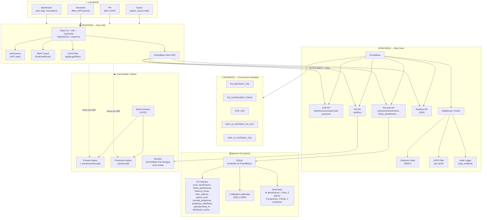

# Arquitetura do Sistema — Meu Concierge de Saúde

## Visão Geral

Plataforma integrada de gestão e acompanhamento proativo de saúde corporativa com controle de acesso baseado em funções (RBAC), governança e conformidade estrita com a LGPD.

---

## Diagrama de Arquitetura

---

## Stack Tecnológico

| Camada         | Tecnologia                                                                     |
| -------------- | ------------------------------------------------------------------------------ |
| Frontend       | React 18 + Vite + TypeScript + TailwindCSS + shadcn/ui                         |
| Backend        | PocketBase (Skip Cloud)                                                        |
| Banco de Dados | SQLite (embutido no PocketBase)                                                |
| Container      | Skip Cloud                                                                     |
| Autenticação   | JWT via PocketBase `users` collection                                          |
| LGPD           | Dupla camada: Collection Rules no PocketBase + `applyLgpdFilter()` no frontend |
| Buckets        | PocketBase File API (`users.avatar`)                                           |
| GitHub         | Não conectado                                                                  |

---

## Perfis de Usuário (RBAC)

| Perfil    | Acesso                                       | Funcionalidades                                                                                 |
| --------- | -------------------------------------------- | ----------------------------------------------------------------------------------------------- |
| BI        | Sem acesso ao sistema                        | Gera planilha .xlsx/.csv externamente                                                           |
| GESTOR    | TOTAL (sem filtro LGPD)                      | Importar planilha, selecionar beneficiários, CRUD completo, dashboards, análise custo-benefício |
| RH        | Filtro LGPD (sem dados clínicos/financeiros) | Visualizar selecionados, distribuir para atendentes, acompanhar status                          |
| ATENDENTE | Filtro LGPD parcial (sem dados financeiros)  | Atender beneficiários, preencher ficha, plano de ação, fechar com alta, dashboard individual    |

---

## Matriz de Visibilidade LGPD

| Campo                   | BI  | Gestão | RH                  | Atendente           |
| ----------------------- | --- | ------ | ------------------- | ------------------- |
| ID                      | Sim | Sim    | Sim                 | Sim                 |
| Nome                    | Sim | Sim    | Sim                 | Sim                 |
| Matrícula               | Sim | Sim    | Sim                 | Sim                 |
| Unidade/Região          | Sim | Sim    | Sim                 | Sim                 |
| Faixa Etária            | Sim | Sim    | Sim                 | Sim                 |
| Telefone/Celular        | Sim | Sim    | Sim                 | Sim                 |
| E-mail                  | Sim | Sim    | Sim                 | Sim                 |
| Tipo de Titularidade    | Sim | Sim    | Sim                 | Sim                 |
| Permite Contato         | Sim | Sim    | Sim                 | Sim                 |
| Data Seleção            | Sim | Sim    | Sim                 | Sim                 |
| Status                  | Sim | Sim    | Sim                 | Sim                 |
| Condição Principal      | Sim | Sim    | Não (Oculto - LGPD) | Sim                 |
| Risco                   | Sim | Sim    | Não (Oculto - LGPD) | Sim                 |
| Custo 12 Meses          | Sim | Sim    | Não (Oculto - LGPD) | Não (Oculto - LGPD) |
| Dados Clínicos          | Sim | Sim    | Não (Oculto - LGPD) | Sim                 |
| Feedback                | Sim | Sim    | Não (Oculto - LGPD) | Sim                 |
| Indicadores Performance | Sim | Sim    | Sim (Agregados)     | Sim (Individuais)   |

---

## Coleções do Banco de Dados

Principais coleções do ecossistema PocketBase:

- **users**: Autenticação JWT e perfis dos usuários do sistema (GESTOR, RH, ATENDENTE), incluindo credenciais e avatar. (3 usuários demo configurados).
- **beneficiarios**: Registros dos beneficiários elegíveis, selecionados e em atendimento, com dados demográficos, clínicos e financeiros. (10 registros seed).
- **fichas_atendimento**: Acompanhamentos e atendimentos clínicos realizados, metas de cuidado, status de contato e desfechos com versionamento contínuo. (5 registros).
- **historico_fichas**: Trilha de auditoria e versionamento de alterações em fichas de atendimento para governança e conformidade.
- **lotes_selecao**: Controle dos lotes importados via planilhas de elegibilidade com volumetria e custos totais. (2 lotes).
- **planos_acao**: Catálogo de planos de ação preventivos e corretivos em saúde com objetivos, necessidades e prazos. (5 planos).
- **controle_programas**: Gestão dos programas de acompanhamento de crônicos e grupos de risco vinculados aos beneficiários. (3 programas).
- **pesquisas_satisfacao**: Pesquisas e avaliações de satisfação enviadas aos beneficiários após alta/atendimento através de token público único. (2 pesquisas).
- **apontamentos_rh**: Apontamentos administrativos de volumetria, evolução, custos e métricas consolidadas para a área de Recursos Humanos.
- **dashboard_cache**: Armazenamento e cache de indicadores analíticos consolidados por atendente, gestão e satisfação.

---

## Fluxo Operacional (9 Etapas)

1. **Etapa 1 — Geração da Planilha pelo BI**: A equipe de BI processa as bases externas de sinistralidade e gera a planilha de elegíveis (.xlsx/.csv).
2. **Etapa 2 — Importação e Validação pelo Gestor**: O Gestor importa a planilha, valida a volumetria, audita os custos e seleciona os beneficiários elegíveis com acesso irrestrito.
3. **Etapa 3 — Recepção pelo RH (Conformidade LGPD)**: O RH recebe a lista de selecionados com aplicação de filtro de privacidade LGPD (dados clínicos e custos financeiros ocultados).
4. **Etapa 4 — Distribuição aos Atendentes**: O RH distribui os beneficiários selecionados para as equipes de enfermagem e atendentes de saúde responsáveis.
5. **Etapa 5 — Atendimento Clínico e Contato**: O Atendente realiza o contato ativo/passivo e preenche a ficha clínica (com filtro LGPD parcial: dados clínicos visíveis, custos financeiros omitidos).
6. **Etapa 6 — Plano de Ação ou Alta Clínica**: Definição de metas de cuidado, encaminhamento a programas de saúde específicos ou concessão de alta clínica.
7. **Etapa 7 — Registro de Indicadores e Evolução**: Registro detalhado da evolução do paciente, pendências, observações e histórico versionado na ficha.
8. **Etapa 8 — Pesquisa de Satisfação & Feedback**: Disparo automático/manual do link de avaliação pública com token único ao beneficiário após alta.
9. **Etapa 9 — Analytics, Relatórios & Dashboards**: O Gestor avalia relatórios gerenciais consolidados, comparativos de desempenho clínico, economia gerada e NPS.

---

## Segredos (Environment Variables)

| Variável                | Finalidade                             |
| ----------------------- | -------------------------------------- |
| PB_INSTANCE_URL         | URL interna do PocketBase              |
| PB_SUPERUSER_TOKEN      | Token admin para migrações/seeds       |
| SITE_URL                | URL pública do app (links de pesquisa) |
| SKIP_AI_GATEWAY_API_KEY | Chave do gateway de IA da Skip         |
| SKIP_AI_GATEWAY_URL     | URL do gateway de IA                   |

---

## Ambientes

| Ambiente | URL                                                       |
| -------- | --------------------------------------------------------- |
| Preview  | https://acompanhamento-de-saude-18c03--preview.goskip.app |
| Produção | https://acompanhamento-de-saude-18c03.goskip.app          |

---

## Limitações Atuais

- **pb_hooks não implantados**: 0 funções backend customizadas no servidor PocketBase.
- **Cron jobs não configurados**: 0 agendamentos automáticos em segundo plano.
- **Envio de e-mail/WhatsApp simulado**: Notificações e links de pesquisa são simulados via interface/banco, sem integração ativa com provedores externos como SendGrid ou Twilio.
- **GitHub não conectado**: Repositório não vinculado a controle de versão remoto externo no momento.

---

## Como Exportar o Diagrama como PNG

1. Copie o bloco de código Mermaid presente na seção [Diagrama de Arquitetura](#diagrama-de-arquitetura) (ou o conteúdo direto do arquivo `docs/diagrama-arquitetura.mermaid`).
2. Acesse o editor online [Mermaid Live Editor](https://mermaid.live) e cole o código no painel de edição.
3. No menu superior/lateral, clique em **Actions** e selecione **Export as PNG** (ou utilize o botão direto de download de imagem).
